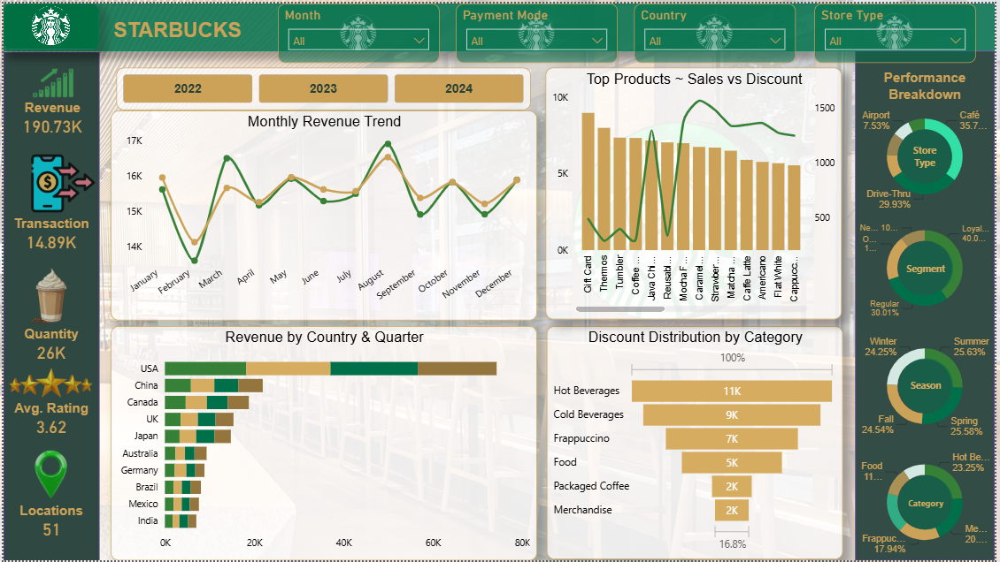

# ☕ Starbucks Sales Dashboard — Power BI

This project is a Starbucks Sales Analytics Dashboard built in Power BI by **Umesh Gajra**. The dataset covers 15,000 transactions across 10 countries from 2022 to 2024. The goal was to analyze sales performance, product trends, customer behavior, and store insights through an interactive and visually branded dashboard.

---

## What's in the Dashboard?

The dashboard has 5 KPI cards on the left side showing the big numbers at a glance:

- 💰 **Revenue** — 190.73K
- 🧾 **Transactions** — 14.89K
- 🛍️ **Quantity Sold** — 26K
- ⭐ **Avg Rating** — 3.62
- 📍 **Locations** — 51

Then there are 4 main charts in the center:

- **Monthly Revenue Trend** — see which months perform best
- **Top Products ~ Sales vs Discount** — which products sell most and get most discounts
- **Revenue by Country & Quarter** — how each country compares
- **Discount Distribution by Category** — where discounts are being applied

And on the right side, 4 donut charts breaking down:
- Store Type (Café leads at 35.7%)
- Customer Segment (Loyalty Members at 40%)
- Season (Summer & Spring are top)
- Product Category

---

## The Dataset

**15,000 rows and 24 columns** covering 3 years of data across 10 countries.

Key columns included:
- Transaction ID, Date, Country, City, Store Type
- Product Category & Product Name
- Unit Price, Quantity, Total Sales, Discount, Net Sales
- Payment Method, Customer Segment, Rating, Wait Time

---

## Filters You Can Use

4 slicers at the top — Month, Payment Mode, Country, Store Type — plus year buttons for 2022, 2023, 2024. Everything updates when you click any filter.

---

## What I Found

- 🇺🇸 USA brings in the most revenue by far
- ☕ Hot Beverages is the #1 category (11K units sold)
- 📅 August is the peak month for sales
- 📱 Most customers pay via Mobile App
- 👑 Loyalty Members make up the biggest customer group

---

## Tools Used

- **Power BI** — dashboard building
- **Excel** — data source
- **DAX Measures**
- **Custom Starbucks Theme**
  

---

Made by **Umesh Gajra**
